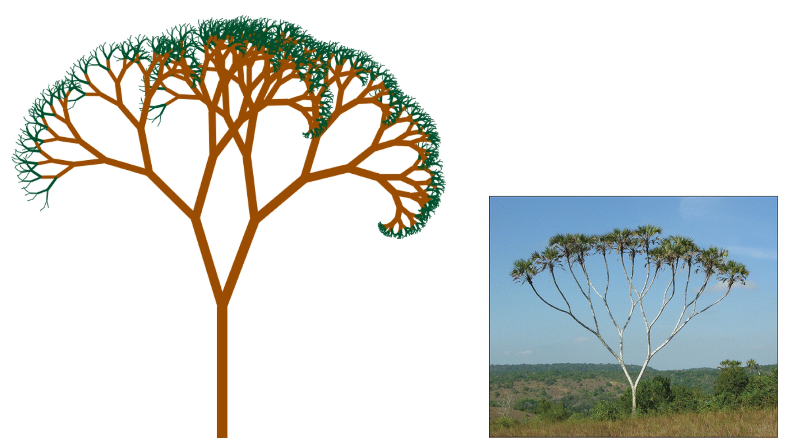

Doum Palm Hyphaene Compressa
======================

[Hyphaene compressa](http://en.wikipedia.org/wiki/Hyphaene_compressa)

> Hyphaene compressa, East African doum palm, is a palm tree in the genus Hyphaene. It is a tree known for its unique branching, unlike most Palms which are not branched.[1] This palm tree is very abundant in Eastern Africa and is a vital socioeconomic resource to the rural pastoralist and agro-pastoralists there. 

License
----------
Copyright &copy; 2014 Daisuke Hirata
Distributed under the [MIT License][mit].
[MIT]: http://www.opensource.org/licenses/mit-license.php
